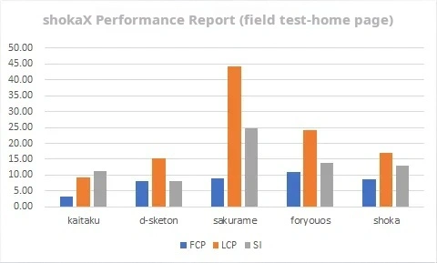
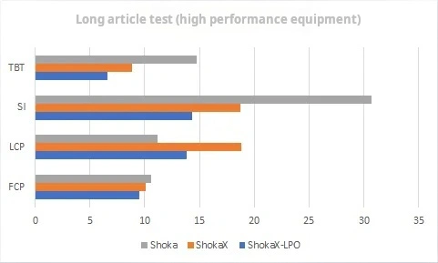

# Performance Optimization

## Performance Report

:::tip
The data below is based on lighthouse mobile device specifications testing.
:::
For preview websites and real-world testing of Shoka: \

- Please note that due to differences between preview websites (CDN, shokaX version, third-party js), real-world testing **does not** reflect the actual performance of ShokaX when deployed, it is just a reference data.

For long articles (50k+ words) laboratory data: \

- ShokaX-LPO refers to ShokaX v0.2.9 with long article optimization enabled.
- Due to third-party factors (such as no text compression in `hexo s`), this data cannot accurately reflect the performance of ShokaX long articles in a production environment, it is for reference only.

## Web Page Optimization

The images in the Shoka theme are the biggest factor affecting performance and can be optimized using the following methods:

### Use modern image formats like webp or avif

According to ShokaX developers' tests, converting Shoka theme images to webp format with level 6 compression can reduce the size by approximately 65% without affecting the image quality (difficult to discern with the naked eye). This can significantly optimize FCP (reduced by approximately 50%) and LCP (reduced by approximately 40%) and improve the initial loading experience. Since ShokaX no longer supports IE11, webp has almost zero compatibility issues.

### Enable the `fixedCover` feature

According to community tests, enabling this option can reduce FCP by 17% and LCP by 80% without optimizing webp. This feature only displays a single cover image, significantly reducing network load.

### Reduce plugin usage

On average, each plugin increases FCP by 0.1-0.3 seconds and SI by 0.3-0.8 seconds, especially plugins like qweather that make numerous HTTP requests and slow down loading speed.

### Compile TypeScript and adjust compression configuration

The stable version of ShokaX provides pre-compiled JavaScript ES2017. If your site requires ES6 compatibility or you want higher performance, refer to the documentation for secondary development or TypeScript official documentation to compile TypeScript. ShokaX uses ES2018 as the default compression configuration for terser, but you can adjust it as needed.

### Disable unused features

ShokaX provides configuration options to disable certain features, such as `noPlayer` and `disableVL`. Both of these options can improve runtime efficiency and reduce JavaScript size. `noPlayer` theoretically reduces JavaScript size by 20%. The performance optimization of `disableVL` is almost negligible, but it improves the user experience in multi-tab browsing.
