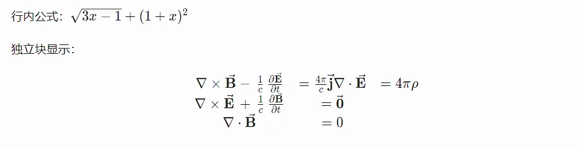

# Article embedded tags

:::tip
Place the modified content in the article, such as `/source/_posts/foo.md`
:::

## MD tags

## Front-matter

- `title`: Article title.
- `date`: Article publication date.
- `comment`: Whether to disable comments for the article.
- `sticky`: When set to `true`, the article will be pinned. If multiple articles are pinned, they will be displayed in reverse chronological order without pagination.
- `tags`: Article tags.
- `cover`: Article carousel image (overrides global settings) and article cover image.
- `audio`: Article background music (overrides global settings). Set to `false` to disable background music.

:::tip
The modified content should be placed within code fences (e.g., `---`), like this:

````markdown
---
title: foo
tags:
  - bar
  - baz
audio: false
---

:::

```yaml
title: Article Title
date: Article Publication Date
comment: false   # true/false to enable/disable comments for this article
sticky  : true   # Pin the article
tags:
- Article Tag 1
- Article Tag 2
categories:
    - [Computer Science, Linux]
cover: cover.png # Article header and preview image (overrides homepage carousel)
audio:
  - https://music.163.com/song?id=1387098940
audio: false
```
````

### Mathematical Formulas (KaTeX)

To add mathematical formulas using [KaTeX](https://katex.org/) in your article, you need to add `math: true` in the Front-matter:

```markdown
---
title: Displaying Mathematical Formulas
math: true
---

Inline formula: $\sqrt {3x-1}+(1+x)^2$

Display as a standalone block:

$$
\begin {array}{c}

\nabla \times \vec {\mathbf {B}} -\, \frac1c\, \frac {\partial\vec {\mathbf {E}}}{\partial t} &
= \frac {4\pi}{c}\vec {\mathbf {j}}    \nabla \cdot \vec {\mathbf {E}} & = 4 \pi \rho \\

\nabla \times \vec {\mathbf {E}}\, +\, \frac1c\, \frac {\partial\vec {\mathbf {B}}}{\partial t} & = \vec {\mathbf {0}} \\

\nabla \cdot \vec {\mathbf {B}} & = 0

\end {array}
$$
```

Preview:



### Quiz

#### Enable this feature

Before using this feature, you need to add `quiz: true` in the Front-matter, for example:

```markdown
---
title: quiz（练习题）
quiz: true
---
```

#### Multiple Choice Questions

For exercises with 1-n options and only one correct option, use the following format:

```markdown
1. Question[]{.gap} {.quiz} - Option - Correct option {.correct}
   {.options}
```

The usage is as follows:

- `1.`: Question number, must be used.
- `[]{.gap}`: Blank space in the question, rendered as a horizontal line (optional).
- `{.correct}`: Correct option in the question.
- `{.options}`: End of the options list.

Example:

```markdown
1. Which of the following options is correct?{.quiz}
  - Option A
  - Option B
  - Option C
  - Option D (correct answer) {.correct}
{.options}
```

### Multiple Choice Questions

Exercise questions with 2 to more options and multiple correct options are formatted as follows:

```markdown
1. Question {.quiz .multi}
  - Option
  - Correct option {.correct}
  - Correct option {.correct}
{.options}
  > - Annotation for option A
  > - Annotation for option B
  > - Annotation for option C
  > {.options}
```

The usage is as follows:

- `1.`: Question number, must be used.
- `{.correct}`: Correct option in the question.
- `{.options}`: End of the options list (use indentation to control).

## Hexo Tags

### links (Link Block)

::: tip
This tag is used to represent a link in rich media format, and can be used for friend links, website sharing, and feature collections, etc.
:::

The configuration format is as follows:

```yaml
- site: # Main title
  owner: # Site owner (optional)
  url: # Site link
  desc: # Site description (optional)
  image: # Site image (optional)
  color: # Site color (optional)
```

- `color`: Needs to be wrapped in double quotes and the value should be a uppercase hexadecimal color code.

Used in the article:
::: code-tabs#shell
@tab Embedded in the article

```text

- site: # Main title
  owner: # Site owner (optional)
  url: # Site link
  desc: # Site description (optional)
  image: # Site image (optional)
  color: # Site color (optional)
# Multiple link reference YAML list format

```

@tab External File

```text
# path is a yaml file

```

Example:

```yaml
- site: # Main title
  owner: # Site owner (optional)
  url: # Site link
  desc: # Site description (optional)
  image: # Site image (optional)
  color: # Site color (optional)
```

:::
