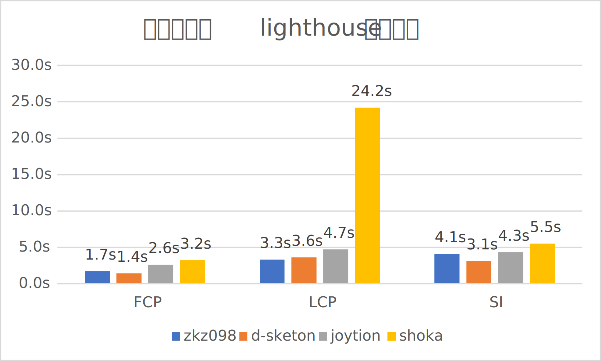

# 性能优化

## 性能报告

:::tip
下方数据均基于 lighthouse 移动设备规格测试
:::
针对预览网站和 shoka 的实地测试: \

附源数据：

|   预览网站   | FCP  |  LCP  |  SI  | ShokaX 版本 |
|:--------:|:----:|:-----:|:----:|:---------:|
|  zkz098  | 1.7s | 3.3s  | 4.1s |   0.4.2   |
| d-sketon | 1.4s | 3.6s  | 3.1s |   0.4.2   |
| joytion  | 2.6s | 4.7s  | 4.3s |  0.3.12   |
|  shoka   | 3.2s | 24.2s | 5.5s |   shoka   |

测试环境：

- Microsoft Edge 122
- 国内网络环境
- Lighthouse 移动设备规格

请注意，由于各预览网站间的差异(CDN、shokaX 版本、第三方 js)，实地测试**并不能**反应 ShokaX 实际部署时的性能，只是一个参考数据

## 优化网页

Shoka 系主题的图片都是性能影响的最大因素，可通过如下方法优化:

### 使用 webp 或 avif 等现代图片格式

根据 ShokaX 开发者测试，对 shoka 主题图片进行 webp 转换+等级 6 压缩，可以在不影响画质(肉眼难以分辨)的情况下，
将大小降低约 65%。
这项可以大幅优化 FCP(约减少 50%)和 LCP(约减少 40%)并提升初访问体验。
由于 ShokaX 已不再支持 IE11，因此 webp 的兼容性问题近乎为 0

### 开启`fixedCover`功能

根据社区测试，此选项可以在不进行 webp 的优化的情况下，将 FCP 降低 17%，LCP 降低 80%。
此功能会让头图仅显示一张以大幅降低网络负载

### 减少插件使用

平均每个插件会让 FCP 增加 0.1-0.3 秒并让 SI 增加 0.3-0.8 秒，尤其是 qweather 类插件
会发起大量的 HTTP 请求并拖慢加载速度。

### 适当调整图片大小

假如你准备使用 fixedCover，参照如下规格配置图片：

- 所有图片采用 webp 格式，且采用压缩方法 6
- `_images.yml` 中的图片使用宽不大于420px的图片，质量建议为 70-80
- `fixedCover` 使用宽不大于1280px的图片，质量建议为 85-95
- 作者头像使用 160px 1:1 的图片，质量建议为 75-85

如果不使用 fixedCover，`_images.yml`均需要不大于1280px（不建议小于900px）的图片

### 关闭不使用的功能

ShokaX 提供了关闭部分功能的配置，例如`noPlayer`和`disableVL`，这两项都可以提高 js 运行时效率并缩小 js 体积。
`noPlayer`理论上可以减少 20%的 js 大小。`disableVL`的性能优化几乎为 0，但提高了多标签页下的用户体验
