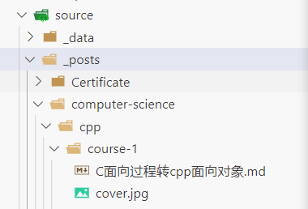

# 主题配置

::: tip
 除非特殊说明，以下配置均在 `/_config.shokax.yml` 或 `/_config.shokaX.yml` 文件中修改
:::

## 基础配置

### 静态资源

```yaml
statics: "/" # 静态文件根目录，可用于 CDN 加速
assets: "assets" # 图片资源存放目录
css: "css" # css 存放目录 (不建议改动)
js: "js" # js 存放目录 (不建议改动)
```

### 自定义网站图片

:::: tip
以下文件的修改均在 `/source/_data/` 中预设的素材文件夹中进行，如 `/source/_data/assets`
:::details 详细步骤

- 在 Hexo 的根目录 `/source` 文件夹下；
- 进入 `/_data` 目录（如果没有则创建）；
- 根据 `/_config.shokax.yml` 或 `/_config.shokaX.yml` 中自定义的图片目录（如 `assets` ），在  `_data` 目录下创建对应的目录。
:::
::::

- 不同的文件名称分别代表对应的图片。
  - `avatar.jpg` 默认情况下对应主页上的个人头像，可修改
  - `favicon.ico` 网站图标
  - `apple-touch-icon.png` 将网页链接添加到主屏幕时的图标
  - `failure.ico` 网站被隐藏时的网站图标
  - `alipay.png` 支付宝捐赠付款码
  - `wechatpay.png` 微信捐赠收款码
  - `paypal.png` PayPal 捐赠收款码
  - `search.png` 搜索下显示的图片

:::tip
大多数文件名可调，建议尽可能地将 png、jpg 替换为 webp 或 avif 以提高性能
:::

### 功能模块

此处指示 ShokaX 功能模块是否开启，在不使用的情况下建议关闭对应模块

```yaml
modules:
  player: true # 启用音乐播放器
  fireworks: true # 启用鼠标点击烟花特效
  unlazyHash: false # 启用unlazy hash预览图支持
  visibilityListener: true # 启用可见度监听器
  tabs: true # 启用选项卡扩展支持，如需开启 summary 功能请一并开启
  quiz: true # 启用文章内问题扩展支持
  fancybox: true # 启用 fancybox 支持（不建议禁用）
```

部分配置的解释：

- 如果需要使用 media tag，请开启 player 模块
- 如果不喜欢切换标签页改变标题这个功能，请关闭 visibilityListener

### 主页配置

```yaml
homeConfig:
  gradient: false # 使用CSS渐变作为文章封面
  # fixedCover 性能比默认的更好，且开启时将启用LCP优化和预加载
  fixedCover: "" # 主页面cover(为空则使用bing随机图片)
```

当 gradient 启用时，将使用渐变色封面代替`_images.yml`，渐变色集不可控制
当 fixedCover 启用时，上方的图片轮播集将被锁定为 fixedCover 配置的图片，`_images.yml`不再控制头图

## Iconfont图标、导航栏、社交链接、侧边栏、大标题

### Iconfont图标

Iconfont用于在各种界面元素中显示小图标，包括导航栏、社交链接按钮、侧边栏图标、音乐播放器等。

:::tip
1、 shokaX使用的是原shoka项目克隆的iconfont图标库，并添加了一些自定义图标。

2、 Iconfont使用的是阿里云CDN，部分地区的用户可能无法访问。
:::

若您希望自定义这些小图标，请遵循下列步骤：

#### 1、接受Iconfont项目邀请

访问 [Iconfont项目邀请链接](https://www.iconfont.cn/invite?type=project&token=LotXIguNze4Ce2GI#%E9%82%80%E8%AF%B7%E4%BD%A0%E5%8A%A0%E5%85%A5%E3%80%8Cshoka%E3%80%8D) 来接受邀请。

:::tip
此邀请链接理论上长期有效，若过期请提issue。
:::

#### 2、进入项目

为了将图标添加到您的项目，请执行以下操作：

- 批量操作
- 全选
- 批量加入购物车
- 点击购物车
- 添加至项目
- 点击新建项目图标
- 输入自己的项目名称
- 确定

#### 3、点击项目设置

在设置中，将“FontClass/Symbol前缀”从默认的“icon-”更改为“i-”，将“Font Family”更改为“ic”，并确保选择了WOFF2、WOFF、TTF、EOT和SVG格式，然后保存。

#### 4、生成代码

点击“没有代码，点击这里生成”，将会得到类似`//at.alicdn.com/t/c/font_4415496_59g1326wajd.css`的链接。

提取字符串`4415496_59g1326wajd`用于更新配置文件中的'iconfont'项：

```yaml
# //at.alicdn.com/t/c/font_4415496_59g1326wajd.css => 4415496_59g1326wajd
iconfont: "4415496_59g1326wajd"
```

#### 5、自定义iconfont图标

现在您可以向项目添加新图标或修改现有图标。如非必要，避免删除图标，因为这可能会影响渲染。

#### 6、修改_iconfont.styl文件

打开文件`/node_modules/hexo-theme-shokax/source/css/_iconfont.styl`进行编辑。

:::tip
为了方便操作，建议为本主题文件夹创建软链接。

| 终端        | 命令                                                         |
|-----------|------------------------------------------------------------|
| Windows CMD | `mklink /J .\themes\shokax .\node_modules\hexo-theme-shokax` |
| Linux Bash  | `ln -s ./themes/shokax ./node_modules/hexo-theme-shokax`     |

此时`_iconfont.styl`路径为`/themes/shokax/source/css/_iconfont.styl`。
:::

在浏览器中打开您的iconfont链接（此处以`//at.alicdn.com/t/c/font_4415496_59g1326wajd.css`为例，请替换为实际链接）。

复制新增图标对应的以“.i-”为前缀的代码，添加到`_iconfont.styl`文件末尾。

例如，添加Gitee图标的代码如下：

```css
.i-gitee:before {
  content: "\e607";
}
```

#### 7、在您的配置中应用

> 例如添加社交媒体链接中的Gitee图标，配置如下：

```yaml
# 在此添加您的社交媒体链接
social:
  gitee: https://gitee.com/yourname || gitee || "#e60026"
```

### 导航栏

```yaml
menu:
  home: / || home
  submenu:
    default: /page/ || user
    link: /page1/ || cloud
  link2: /page2/ || coffee
```

此处的配置分为如下两种：

1. 独立导航链接（例如 `home` 和 `link2`）
   - `home(link2)` 为本地化键（详见本地化）和备用名称；
   - `/(/page2/)` 为超链接地址，可为站外链接（需要带 `https`）；
   - `||` 分隔符，分隔链接和图标；
   - `home(user)` 图标，具体可参见 `/source/css/_iconfont.styl`。
2. 下拉菜单（例如 `submenu`）
   - `default` 为 dropbox 显示的内容，不建议在此处放置超链接地址（建议设置为 `/`）；
   - 剩余部分为 n 个不重复的独立导航链接。

### 社交链接

```yaml
social:
  github: https://github.com/name || github || "#191717"
  # google: https://plus.google.com/yourname || google
  # twitter: https://twitter.com/yourname || twitter || "#00aff0"
  # zhihu: https://www.zhihu.com/people/yourname || zhihu || "#1e88e5"
  # music: https://music.163.com/#/user/home?id=yourid || cloud-music || "#e60026"
  # weibo: https://weibo.com/yourname || weibo || "#ea716e"
  # about: https://about.me/yourname || address-card || "#3b5998"
  # email: mailto:foo@xxx.com || envelope || "#55acd5"
  # facebook: https://www.facebook.com/yourname || facebook
  # stackoverflow: https://stackoverflow.com/ || stack-overflow
  # youtube: https://youtube.com/yourname || youtube
  # instagram: https://instagram.com/yourname || instagram
  # skype: skype:yourname?call|chat || skype
  # douban: https://www.douban.com/people/yourname/ || douban
```

启用对应社交链接，只需要解除对应行注释即可。**v0.3.8 之前需要保留至少一个链接**。

格式：

```yaml
social:
  keyname: link || logo || "color"
```

- `keyname`：合法且不重复的 yaml 键；
- `link`：社交网站链接；
- `logo`：社交网站 logo；
- `color`：社交网站 logo 颜色，选填（不填为字体颜色）；

### 侧边栏

::: tip
可以选择左侧或右侧（`position: right`或`position: left`）。
头像文件可在静态文件目录 `/source/_data/assets` 中修改，如`/source/_data/assets/avatar.jpg`。
:::

```yaml
sidebar:
  position: right # left/right分别对应左侧/右侧
  avatar: avatar.jpg
```

### 大标题

```yaml
alternate: "foo" #站点大标题，（比 title 高一级，但仅在 index 显示）
```

## 页脚设置

### 底部设置

::: tip
开启后在页面底部显示随机文章和最近评论。
:::

```yaml
widgets:
  random_posts: true # 随机文章
  recent_comments: true # 显示最近评论
```

### 字数和阅读时间统计

```yaml
# 页尾全站统计
footer:
  since: 2010 # 开始时间
  count: true # 开启
# 文章界面统计
post:
  count: true # 开启
```


## 预加载、解析地址设置

```yaml
performance:
  # 使用 preconnect 预加载的地址 (不建议超过三个)
  preConnect:
    - "https://lf9-cdn-tos.bytecdntp.com"
  # 使用 dns-prefetch 预解析的地址
  dnsPrefetch:
    - "https://cdn.jsdelivr.net"
    - "https://unpkg.com"
```

:::details 我该使用 preConnect 还是 dnsPrefetch？
`preConnect` 选项会对链接进行预连接，这会极大加速 CDN 文件/评论系统的加载速度，但使用过多会影响首屏性能。

`dnsPrefetch` 适用于“不值得使用 `pre-connect`”的，此模式仅会优化 DNS 解析，适用于部分非关键站外链接（例如广告和站外视频）。
:::

## SEO 优化和访客优化

```yaml
seo:
  bing:
  google:
  yandex:
  baidu:

visitor:
  clarity: false
  baiduAnalytics: false
  googleAnalytics: false
```

SEO 只需要在对应搜索引擎后填入验证码即可（域名验证 -> meta 验证 -> meta 标签的 content）。

visitor 需要填入对应项目的许可码，一般包含在 js 文件/script 标签中。例如，clarity 一般是 js 代码中 function 的第五个参数，百度统计是 `?hm=` 后面的代码。

## 其他设置

### 夜间模式

```yaml
darkmode: true # true/false分别对应打开/关闭夜间模式
```

默认情况下，是否开启夜间模式取决于（优先级从高到低）：

- 访客点击头部自行选择
- 浏览器设置主题色调
- darkmode 配置

### 自动定位

::: tip
开启后默认情况下，再次打开页面，会自动滚动到上次浏览的位置。
:::

```yaml
auto_scroll: false
```

### 网站标题自定义

:::: tip
自动网站点击之后和隐藏之后的标题，可覆盖原本呈现的文字。
以下配置均在 `/_source/_data/languages.yml` 文件中修改。
:::details 详细步骤

- 在 Hexo 的根目录下 `source` 文件夹中；
- 进入`_data` 目录（如果没有则创建）；
- 在下面创建文件 `languages.yml`；
- 修改网站标题在不同语言情况下 favicon show 时，和隐藏呈现的文字。
:::
::::

```yaml
# language
zh-CN:
  # items
  favicon:
    show: 不负韶华
    hide: 以梦为马！

zh-HK:
  favicon:
    show: 不负韶华
    hide: 以梦为马！

zh-TW:
  favicon:
    show: 不负韶华
    hide: 以梦为马！

en:
  favicon:
    show: 不负韶华
    hide: 以梦为马！

ja:
  favicon:
    show: 不负韶华
    hide: 以梦为马！
```

- 保存文件即可。

## 图片自定义

### 自定义网站轮播图

- 在上面的 `_data` 目录下创建 `images.yml`；
- 在文件内存入轮播图图片即可替换原本自带的轮播图；
- 类似如下，可存入图床当中。

```yaml
- https://i.imgtg.com/2023/03/09/YS2LU.jpg
- https://i.imgtg.com/2023/03/09/YSj7p.jpg
- https://i.imgtg.com/2023/03/09/YS6XY.jpg
- https://i.imgtg.com/2023/03/09/YSIlc.jpg
- https://i.imgtg.com/2023/03/09/YQSYM.jpg
- https://i.imgtg.com/2023/03/09/Y0xvg.jpg
- https://i.imgtg.com/2023/03/09/Y0iNK.jpg
- https://i.imgtg.com/2023/03/09/Y0zdB.jpg
- https://i.imgtg.com/2023/03/09/Y0kTl.jpg
- https://i.imgtg.com/2023/03/09/Y0hOs.jpg
```

自0.3.7版本开始，ShokaX 允许主页和文章使用不同的图片源：
以下文件中以`_`开头的为主题文件夹下，其他均为`source/_data`目录下：

- `images_index.yml`为首页图片源文件，如果主题文件夹下存在`_images_index.yml`，则会使用主题文件夹下的文件，否则使用`source/_data/images_index.yml`
- `images.yml`为通用图片源文件，作为首页的后备图片源和文章的图片源。如果未找到`images.yml`，则会使用主题文件夹下的`_images.yml`

### 首页精选与分类翻转块

1、修改站点配置，在 Hexo 根目录 `/_config.yml` 中找到 `category_map`，配置每个分类对应的英文映射。

::: tip
Hexo 会将路径中的特殊字符 `~\``!@#$%^&\*()-\_+={}|\;:"'<>,.?` 及空格全部会替换成 `-`。
:::

```yaml
category_map:
  计算机科学: computer-science
  C++: cpp
  郑莉老师C++语言程序设计: course-1
  Linux: Linux
```

2、设置文章所属的目录

`/source/_posts` 为上传文章的保存目录。

`categories` 的设置要根据上面的 `category_map` 以及文件顺序顺序书写。例如，某文件位于 `计算机科学/C++/郑莉老师C++语言程序设计` 目录下，根据上面的映射，在存储文件的 `_posts` 文件路径下就位于 `/source/_posts` 下 `/computer-science/cpp/course-1` 目录下。

```yaml
categories:
  - [计算机科学, C++, 郑莉老师C++语言程序设计]
```



3、如上图所示，在最底部的文件目录方式 `cover.jpg` 文件，此图片将作为首页精选的图片。自此 `文章精选` 和 `鼠标悬浮翻转` 也将实现。

## 实验性特性

:::caution 风险提示
实验性特性均不稳定，随时可能引入破坏性更改，且部分有明显副作用。
:::

::: details 长文章优化

```yaml
experiments:
  optimizeLongPosts: true # 开启长文章优化
```

当文章过长时（≥5 万字），文章页面的 FPS 会下降到 10FPS 左右，部分渲染性能较差的设备还会出现假死现象。

实验室数据显示在 2 万字时 FPS 便会出现波动，3 万字时就可以感觉到波动了，5 万字时页面已经十分卡顿。如果页面有大量 Katex 公式则此问题会更严重。

此问题在 shoka 时期就已存在，因此 shokaX 引入了长文章优化，底层原理是使用 `content-visibility` 暴力缩短渲染范围以大幅提高性能。

实验室数据显示此选项可将 FPS 由 10 提升到 25 左右（4x CPU slowdown）并解决卡死问题，但此功能存在 *导航栏抖动* 和 *进度条抖动* 问题，可能影响到浏览体验。

- 导航栏抖动：在滑动时导航栏会反复弹出收回，时间较短（一般不超过 1s）。
- 进度条抖动：返回顶部的文字和滑动条的长度与文章实际长度不符，存在 ±1-5% 的误差。

上述问题均是由于此方法导致的 `window.scrollY` 抖动引起的，如果你有好的解决方法欢迎发起 Pull Request。

综上所述，长文章优化功能仅建议在有文章字数超过 3 万字或站点主要面向渲染性能较差的设备时启用。
:::
